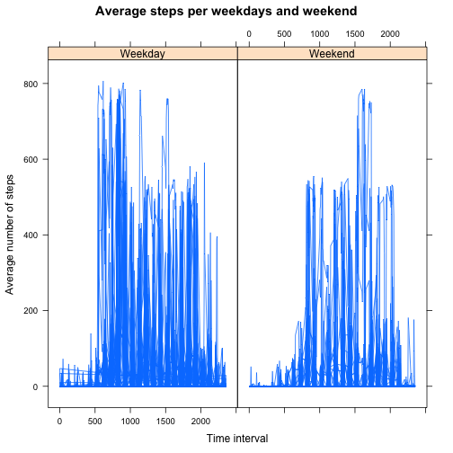

## Loading and preprocessing the data

Load Data:


```r
dataSource <- read.csv(unz("./activity.zip", "activity.csv"))
```

Preprocess the data by excluding NA values:


```r
steps <- dataSource$steps
date <- dataSource$date
interval <- dataSource$interval
filter <- !is.na(steps)
filterSteps <- steps[filter]
filterDate <- date[filter]
```

Create a factor vector for the non-NA days


```r
daysFactor <- factor(filterDate)
totalSteps <- tapply(filterSteps, daysFactor, FUN = sum)
```

Plot the histogram:


```r
histogram(totalSteps,
          xlab = "Steps per day", 
          main = "Total steps per day", 
          type = "count")
```

 

## What is mean total number of steps taken per day?

The mean total number of steps taken per day is


```r
mean <- mean(totalSteps)
mean
```

```
## [1] 10766.19
```

The median of the total number of steps taken per day is


```r
median <- median(totalSteps)
median
```

```
## [1] 10765
```

## What is the average daily activity pattern?

A factor variable was created to store the time intervals. 


```r
intervalFactor <- factor(interval)
levels <- nlevels(intervalFactor)
intervalFactor <- factor(interval)[1:levels]
```

Then the average number of steps for each 5 minute period was calculated


```r
avgSteps <- tapply(steps, factor(interval), FUN = mean, na.rm = TRUE)
avgSteps <- sapply(avgSteps, simplify = array, round, 2)
```

The average daily actitivity pattern can be seen by analyzing the plot generated bellow:


```r
xyplot(as.numeric(avgSteps) ~ interval[1:288], 
       type = "l", 
       xlab = "Interval",
       ylab = "Average steps", 
       main = "Daily activity pattern")
```

 

In order to understand which 5-minute interval, on average across all the days in the dataset, contains the maximum number of steps, a new data frame was created, by combining the average steps per day variable and the interval factor. Once that new data frame was created, it was sorted by the number of average steps in decreasing order:


```r
newDataFrame <- data.frame(intervalFactor, avgSteps)
newDataFrame <- newDataFrame[order(newDataFrame$avgSteps, decreasing = TRUE),]
intervalMax <- newDataFrame$intervalFactor[1]
intervalMax <- as.numeric(as.character(intervalMax))
```

```
## [1] 835
```


## Imputing missing values

The total number of missing values from the original data set is 


```r
length(steps[is.na(steps)])
```

```
## [1] 2304
```

The strategy for filling in all of the missing values in the dataset was executed as follows. First, iterate through all the NA records. For each NA record, calculate the appropriate daily time interval (1 to 288). Once that was calculated,  simple look up at the "average steps per time interval" variable in order to retrieve the average value for that time interval 


```r
stepsWithoutNA <- steps
for (i in which(sapply(stepsWithoutNA, is.na))) {
    if (i <= 288){
    stepsWithoutNA[i] <- avgSteps[i]
  } 
  else{
    j <- i%%288 + 1
    stepsWithoutNA[i] <- avgSteps[j]
  }
}
```

A new data set was then created with the NA variables filled in with the averaged value for the corresponding time interval


```r
newFactor <- factor(date)
stepsWithoutNATotal <- tapply(stepsWithoutNA, newFactor, FUN = sum)
```

An histogram was plotted with the new data set:


```r
histogram(stepsWithoutNATotal, breaks = 10, 
          xlab = "Total number of steps per day", 
          main = "Total steps per day without missing values", 
          type = "count")
```

 

Finally, the mean and medium for the new data set was calculated:

Mean:


```r
meanValue <- mean(stepsWithoutNATotal)
```

```r
meanValue
```

```
## [1] 10766.18
```
Median:


```r
medianValue <- median(stepsWithoutNATotal)
```

```r
medianValue
```

```
## [1] 10766.13
```
The new mean and median values don't differ in a significant manner from the original data set. The impact of imputing missing data on the estimates of the total daily number of steps introduced no significant distortions into the dataset and analysis.

## Are there differences in activity patterns between weekdays and weekends?

A new factor variable was created in the dataset with two levels – "weekday" and "weekend" indicating whether a given date is a weekday or weekend day.


```r
dateObj <- as.Date(date)
dayOfWeek <- weekdays(dateObj)
weekendDays <- c("Saturday", "Sunday")
DF <- data.frame(dateObj, intervalFactor, stepsWithoutNA, dayOfWeek)
isWeekend <- DF$dayOfWeek %in% weekendDays
DF$dayType = factor(isWeekend,labels = c("Weekday","Weekend"))
```

A panel plot containing a time series plot of the 5-minute interval (x-axis) and the average number of steps taken, averaged across all weekday days or weekend days (y-axis) was created:


```r
# plot the time series
xyplot(DF$stepsWithoutNA ~ interval | DF$dayType, layout = c(2, 1), type = "l", 
       xlab = "Time interval", ylab = "Average number of steps", main = "Average steps per weekdays and weekend" )
```

 
